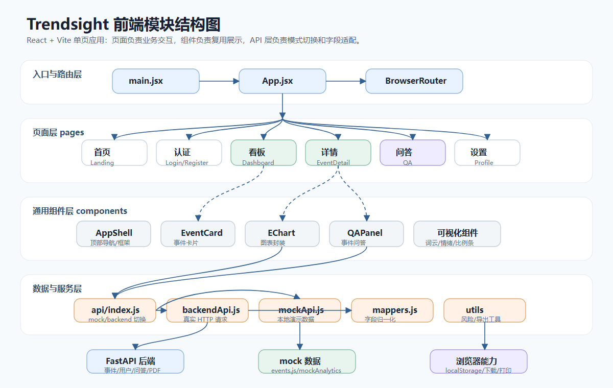
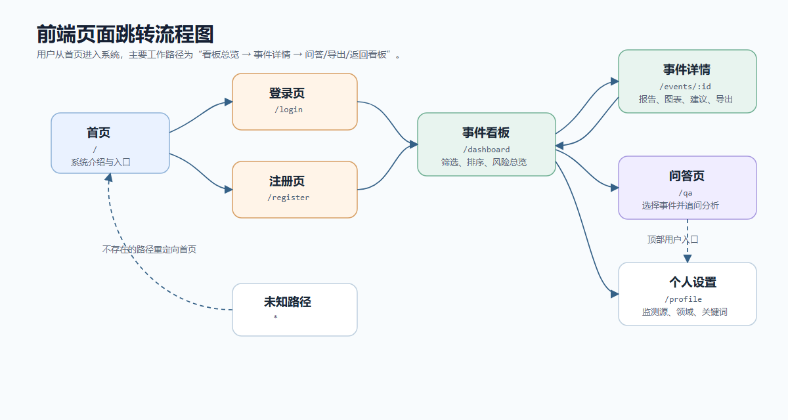
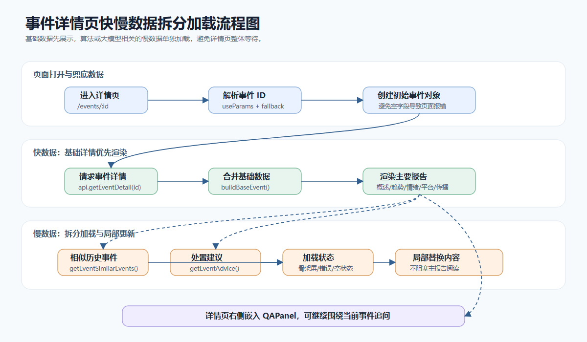
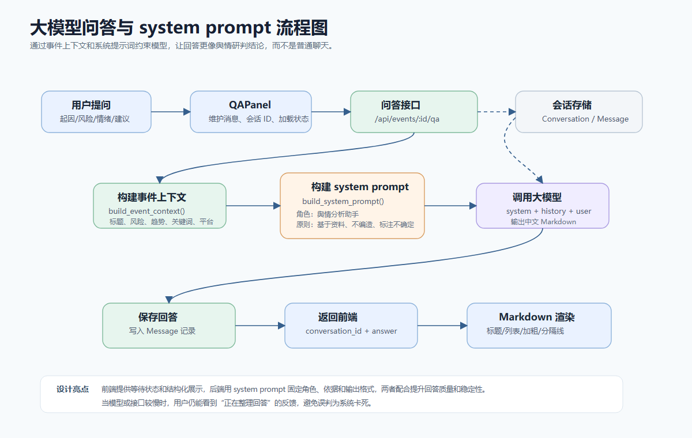
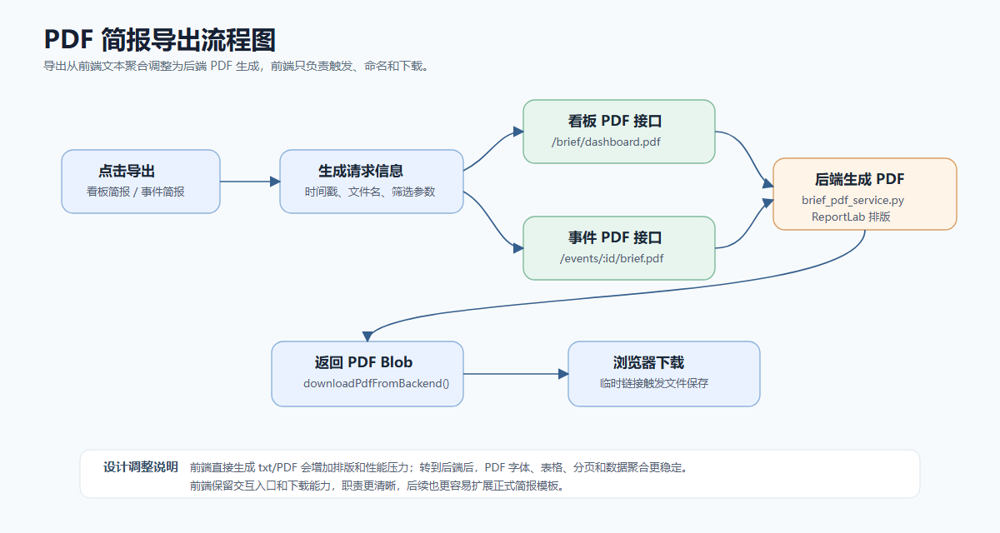
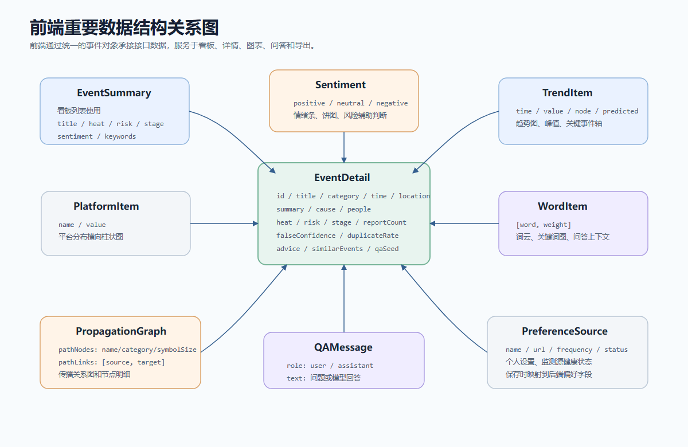

# Trendsight 前端系统结构设计说明草稿

## 一、模块设计

本项目的前端部分采用 React + Vite 构建，为单页应用结构。前端主要负责系统页面展示、用户交互、数据请求、接口数据适配、图表可视化、事件问答交互以及简报导出入口等功能。整体设计时，将页面、通用组件、接口访问、数据映射和工具函数进行分层，使页面逻辑尽量清晰，便于后期维护和联调。



### 1. 应用入口与路由模块

应用入口位于 `frontend/src/main.jsx`，负责创建 React 根节点，并通过 `BrowserRouter` 启用前端路由。路由注册位于 `frontend/src/App.jsx`，系统按照功能划分为落地页、登录页、注册页、事件看板、事件详情页、智能问答页和个人设置页。

该模块的设计目标是把不同页面的访问路径统一管理。用户进入系统后，可以从首页跳转到登录或注册页面，登录后进入事件看板，再从事件列表进入事件详情，也可以进入独立问答页面或个人设置页面。对于不存在的路径，系统会自动跳转回首页，避免用户进入空白页面。



### 2. 用户认证与个人设置模块

用户认证页面位于 `frontend/src/pages/AuthPages.jsx`，包括登录和注册两个入口。该模块会根据当前 API 模式决定使用真实后端登录接口还是本地演示逻辑。登录成功后，前端将用户名和令牌保存到本地存储中，供后续页面展示用户信息和发起带认证信息的请求。

个人设置页面位于 `frontend/src/pages/ProfilePage.jsx`，主要负责维护用户关注领域、关键词、监测平台地址、更新频率和监测源状态。该模块将监测源按“运行正常”和“限流或异常”分组展示，方便用户快速判断数据采集侧的运行情况。保存时会将前端表单数据整理为后端可以接收的用户偏好结构。

### 3. 事件看板模块

事件看板页面位于 `frontend/src/pages/DashboardPage.jsx`，是系统的主工作台。该页面展示当前监测事件的总体情况，包括事件数量、需优先处理事件、监测源状态、事件列表、排序筛选、风险筛选和分页控制。

该模块的核心设计思路是先让用户获得全局态势，再进入具体事件。页面左侧以事件列表为主，展示标题、阶段、风险等级、时间、报道量、讨论量、情绪和热度等信息；右侧为辅助信息栏，展示高风险事件和监测源健康状态。用户可以通过搜索、排序和风险筛选快速缩小范围。

### 4. 事件详情与分析报告模块

事件详情页面位于 `frontend/src/pages/EventDetailPage.jsx`，是前端最复杂的页面模块。该页面围绕单个事件展示完整分析报告，包括事件概述、热度趋势、平台分布、情绪分布、关键词词云、生命周期阶段预测、传播节点、可信度核验、相似历史事件、处置建议和事件问答。

该模块采用“基础数据优先加载、慢数据拆分加载”的设计。事件基础信息先加载并渲染，保证用户能尽快看到标题、摘要、风险、热度、趋势等关键内容；相似事件和处置建议属于依赖算法或后端处理的慢数据，因此单独设置加载状态和错误状态。这样即使某个接口较慢，页面也不会整体卡住，提升了系统可用性。



### 5. 智能问答模块

智能问答组件位于 `frontend/src/components/QAPanel.jsx`，既可以嵌入事件详情页，也可以在独立问答页 `frontend/src/pages/QAPage.jsx` 中使用。该模块允许用户围绕当前事件询问起因、风险、情绪、传播路径和处置建议。

在前端设计上，问答模块维护消息列表、输入框内容、会话 ID 和加载状态。发送问题后，系统会先将用户问题加入消息区，再调用后端问答接口。如果处于本地演示模式，则使用前端内置逻辑生成回答，保证系统在没有后端时也能演示完整流程。大模型回答可能包含 Markdown 格式，因此前端对标题、分隔线、列表、加粗和行内代码进行了轻量解析，使回答在页面上更接近正式分析报告。

问答质量方面，后端服务通过 system prompt 约束模型角色、回答依据、回答结构和不确定性表达，使大模型回答更稳定，更符合舆情分析系统的使用场景。



### 6. 图表与可视化模块

前端可视化主要由 ECharts 和自定义组件共同完成。通用图表封装位于 `frontend/src/components/EChart.jsx`，负责 ECharts 实例初始化、配置更新、窗口变化适配和组件销毁。事件详情页基于该组件生成趋势图、平台分布图、情绪图、生命周期预测图和传播关系图。

除 ECharts 外，系统还设计了若干轻量可视化组件，例如 `SentimentBar.jsx` 用于展示情绪比例，`WordCloud.jsx` 用于生成关键词词云，`SentimentCrowd.jsx` 用于以人群图形式展示情绪分布。这些组件让前端在不同页面中复用可视化能力，也使页面表达方式更加直观。

### 7. API 通信与数据适配模块

接口访问逻辑位于 `frontend/src/api/`。`index.js` 根据环境变量选择 mock API 或真实后端 API；`backendApi.js` 封装真实 HTTP 请求；`mockApi.js` 提供本地模拟数据；`mappers.js` 负责把后端返回字段转换为前端统一数据结构。

该模块的设计重点是降低前后端联调成本。后端字段可能存在 `event_id`、`eventId`、`id` 等不同命名，前端页面如果直接使用这些字段，会导致页面逻辑分散且容易出错。因此系统在 mapper 层统一处理字段名、时间格式、百分比、关键词、传播节点和建议结构，让页面只依赖稳定的前端数据结构。

### 8. 简报导出模块

前端导出相关工具位于 `frontend/src/utils/briefExport.js`。早期设计中，简报可以由前端直接聚合字段并导出文本文件；后来考虑到 PDF 排版、中文字体、表格布局、数据完整性和浏览器性能压力，导出逻辑调整为由后端生成 PDF，前端只负责组织请求参数、生成文件名并触发下载。

这一调整使前端负担变轻，也让导出结果更加稳定。事件看板可导出看板简报，事件详情页可导出单个事件简报，同时还保留图表报告打印入口，满足不同使用场景。



## 二、重要数据结构设计

前端虽然不直接设计数据库表，但需要设计稳定的页面数据结构。前端数据结构的主要作用是承接后端接口数据，并服务于页面展示、筛选、图表渲染和问答交互。



### 1. 事件摘要结构 EventSummary

事件摘要用于事件看板列表展示，主要字段如下：

| 字段名 | 含义 | 用途 |
| --- | --- | --- |
| `id` | 事件唯一标识 | 页面跳转、接口请求 |
| `title` | 事件标题 | 列表和详情页主标题 |
| `category` | 事件分类 | 辅助用户判断事件类型 |
| `time` | 事件时间 | 展示事件发生或更新时间 |
| `location` | 事件地区 | 展示事件范围 |
| `summary` | 事件摘要 | 展示事件概要 |
| `heat` | 热度指数 | 排序、风险判断、图表展示 |
| `risk` | 风险等级 | 高、中高、中、低 |
| `stage` | 生命周期阶段 | 潜伏期、成长期、高潮期、衰退期 |
| `reportCount` | 报道数量 | 衡量事件传播规模 |
| `sentiment` | 情绪分布对象 | 展示正向、中性、负向占比 |
| `keywords` | 关键词数组 | 搜索、标签和问答上下文 |

### 2. 事件详情结构 EventDetail

事件详情结构在事件摘要基础上增加更多分析字段：

| 字段名 | 含义 | 用途 |
| --- | --- | --- |
| `cause` | 直接起因 | 事件概述模块展示 |
| `people` | 涉事主体 | 展示相关人群或机构 |
| `falseConfidence` | 可信度或真实性置信度 | 可信度核验模块展示 |
| `duplicateRate` | 重复传播率 | 辅助判断信息重复扩散情况 |
| `platforms` | 平台分布数组 | 平台占比图 |
| `trend` | 趋势时间序列 | 热度趋势图和节点轴 |
| `words` | 关键词及权重数组 | 词云和关键词分析 |
| `similarEvents` | 相似历史事件 | 历史对比模块 |
| `pathNodes` | 传播节点数组 | 传播关系图 |
| `pathLinks` | 传播边数组 | 传播关系图连线 |
| `qaSeed` | 问答初始参考文本 | 本地演示问答 |
| `advice` | 处置建议摘要 | 建议模块展示 |
| `adviceItems` | 分类建议数组 | 风险判断、信息核验、处置建议 |
| `authenticity` | 真实性分析对象 | 虚假文本和来源比例判断 |
| `geoDiscussion` | 地域讨论数据 | 地理分布扩展展示 |

### 3. 情绪分布结构 Sentiment

```js
{
  positive: 42,
  neutral: 34,
  negative: 24
}
```

该结构用于情绪条、情绪饼图、事件卡片中的负面情绪展示，也参与部分高风险提醒判断。使用百分比结构可以直接映射到 CSS 宽度和 ECharts 数据。

### 4. 趋势数据结构 TrendItem

```js
{
  time: "08:00",
  value: 980,
  node: "首批现场视频发布",
  predicted: false
}
```

趋势数据用于报道量变化图。`time` 表示时间点，`value` 表示该时段报道量或热度值，`node` 表示重要传播事件节点，`predicted` 表示是否为预测数据。

### 5. 传播关系结构

传播节点使用 `pathNodes` 表示，传播关系使用 `pathLinks` 表示：

```js
pathNodes: [
  { name: "社区求助帖", category: 0, symbolSize: 52 },
  { name: "应急部门通报", category: 2, symbolSize: 58 }
]

pathLinks: [
  ["社区求助帖", "应急部门通报"]
]
```

该结构可以直接转换为 ECharts graph 图所需的节点和边，便于展示事件从原始信息到媒体、官方、平台扩散的过程。

### 6. 问答消息结构

```js
{
  role: "assistant",
  text: "已载入当前事件，可询问起因、风险、情绪、传播路径和处置建议。"
}
```

问答消息结构用于前端维护聊天窗口。`role` 区分用户和助手，`text` 保存消息内容。前端会根据角色设置不同样式，并对助手回答进行 Markdown 渲染。

### 7. 用户偏好与监测源结构

```js
{
  name: "微博",
  url: "https://...",
  frequency: "10 分钟",
  status: "正常"
}
```

该结构用于个人设置页展示监测平台、更新频率和运行状态。保存时会转换为后端需要的 `platform_name`、`frequency_minutes` 和 `status` 字段。

## 三、程序函数清单

### 1. 路由与页面级函数

| 函数名 | 所在文件名 | 函数功能 | 参数说明 | 算法描述 |
| --- | --- | --- | --- | --- |
| `App` | `frontend/src/App.jsx` | 注册系统前端路由 | 无 | 使用 React Router 定义页面路径和组件映射，对未知路径重定向到首页。 |
| `LandingPage` | `frontend/src/pages/LandingPage.jsx` | 渲染系统首页 | 无 | 展示系统定位、功能入口和主要功能卡片，引导用户进入登录或注册流程。 |
| `AuthLayout` | `frontend/src/pages/AuthPages.jsx` | 登录和注册页面的公共布局 | `mode`：登录或注册模式 | 根据模式切换页面文案和表单字段，提交时选择真实登录接口或本地登录逻辑。 |
| `LoginPage` | `frontend/src/pages/AuthPages.jsx` | 登录页面入口 | 无 | 调用 `AuthLayout` 并传入 `login` 模式。 |
| `RegisterPage` | `frontend/src/pages/AuthPages.jsx` | 注册页面入口 | 无 | 调用 `AuthLayout` 并传入 `register` 模式。 |
| `DashboardPage` | `frontend/src/pages/DashboardPage.jsx` | 渲染事件看板 | 无 | 维护搜索、筛选、排序、分页和监测源状态，调用 API 获取事件列表并生成看板指标。 |
| `EventDetailPage` | `frontend/src/pages/EventDetailPage.jsx` | 渲染事件详情报告 | 无，事件 ID 来自路由参数 | 先加载事件基础信息，再拆分加载相似事件和处置建议，并生成多种图表配置。 |
| `QAPage` | `frontend/src/pages/QAPage.jsx` | 渲染独立智能问答页 | 无 | 获取热门事件列表，维护当前选中事件，并复用 `QAPanel` 完成问答交互。 |
| `ProfilePage` | `frontend/src/pages/ProfilePage.jsx` | 渲染个人设置页 | 无 | 加载用户偏好，维护监测源、关注领域和关键词状态，并提供保存和退出登录操作。 |

### 2. 看板与详情辅助函数

| 函数名 | 所在文件名 | 函数功能 | 参数说明 | 算法描述 |
| --- | --- | --- | --- | --- |
| `normalizeSource` | `frontend/src/pages/DashboardPage.jsx` | 规范化监测源数据 | `source`：原始监测源；`index`：序号 | 将不同来源字段统一为名称、网址、频率和状态，并将异常状态统一显示为“限流”。 |
| `compactSourceUrl` | `frontend/src/pages/DashboardPage.jsx` | 简化监测源网址显示 | `url`：完整网址 | 去掉协议头和末尾斜杠，空值时显示未配置网址。 |
| `InsightBlock` | `frontend/src/pages/DashboardPage.jsx` | 渲染右侧洞察块 | `title`：标题；`children`：内容 | 将高风险事件、监测源状态等辅助信息统一包装为卡片区块。 |
| `createEmptyDetailEvent` | `frontend/src/pages/EventDetailPage.jsx` | 创建空事件详情对象 | `id`：事件 ID | 在数据尚未加载时提供完整默认字段，避免页面访问空字段时报错。 |
| `resolveFallbackEvent` | `frontend/src/pages/EventDetailPage.jsx` | 解析详情页兜底事件 | `id`：事件 ID | 在 mock 数据中查找事件；真实后端模式下找不到则返回空事件结构。 |
| `buildBaseEvent` | `frontend/src/pages/EventDetailPage.jsx` | 合并兜底事件和接口事件 | `fallbackEvent`：兜底数据；`nextEvent`：接口数据 | 以接口数据覆盖兜底数据，同时对情绪、趋势、关键词、传播节点等数组字段保留合理默认值。 |
| `getInitialDeferredContent` | `frontend/src/pages/EventDetailPage.jsx` | 初始化慢加载内容 | `event`：事件对象；`keepFallbackContent`：是否保留兜底内容 | 在 mock 模式下保留本地相似事件和建议，在后端模式下等待异步接口加载。 |
| `normalizeSimilarEventItem` | `frontend/src/pages/EventDetailPage.jsx` | 规范化相似事件展示项 | `item`：原始相似事件；`index`：序号 | 支持字符串或对象形式的相似事件，统一生成标题、相似度标签和原因文本。 |
| `formatCount` | `frontend/src/pages/EventDetailPage.jsx` / `frontend/src/components/EventCard.jsx` | 格式化数量 | `value`：数字 | 大于一万时转换为“万”单位，否则使用本地化数字格式。 |
| `getEventContextTag` | `frontend/src/pages/EventDetailPage.jsx` | 生成事件上下文标签 | `event`：事件对象 | 将有效分类和地点拼接为短标签，过滤“未分类”“未标注地区”等无效文本。 |

### 3. 图表与可视化函数

| 函数名 | 所在文件名 | 函数功能 | 参数说明 | 算法描述 |
| --- | --- | --- | --- | --- |
| `EChart` | `frontend/src/components/EChart.jsx` | 通用 ECharts 图表组件 | `option`：图表配置；`className`、`style`：样式 | 初始化 ECharts 实例，监听窗口变化，配置变化时更新图表，组件销毁时释放实例。 |
| `buildVisibleTrend` | `frontend/src/pages/EventDetailPage.jsx` | 生成可见趋势数据 | `trend`：完整趋势数组 | 识别第一个有明显变化的趋势点，保留必要上下文，减少无意义空白趋势。 |
| `buildTrendOption` | `frontend/src/pages/EventDetailPage.jsx` | 生成报道趋势图配置 | `visibleTrend`：可见趋势数组 | 使用柱状图展示报道量，折线展示趋势，并标注峰值和关键事件点。 |
| `buildPieOption` | `frontend/src/pages/EventDetailPage.jsx` | 生成情绪环形图配置 | `event`：事件对象 | 将正向、中性、负向情绪转换为饼图数据，并在中心展示主导情绪结论。 |
| `buildPlatformBarOption` | `frontend/src/pages/EventDetailPage.jsx` | 生成平台分布图配置 | `event`：事件对象 | 按平台占比排序，使用横向柱状图展示不同平台报道占比。 |
| `buildLifecycleOption` | `frontend/src/pages/EventDetailPage.jsx` | 生成生命周期预测图配置 | `event`：事件对象 | 基于当前阶段和最近趋势值生成后续预测点，并用分区标记展示生命周期阶段。 |
| `buildTraceForceOption` | `frontend/src/pages/EventDetailPage.jsx` | 生成传播节点关系图配置 | `event`：事件对象 | 将传播节点和传播连线转换为力导向图数据，展示首发、意见领袖、官方、媒体等传播角色。 |
| `buildKeywordGraphOption` | `frontend/src/pages/EventDetailPage.jsx` | 生成关键词关系图配置 | `event`：事件对象 | 按关键词类别构建节点和关联边，展示核心关键词之间的关系。 |
| `buildKeywordTreemapOption` | `frontend/src/pages/EventDetailPage.jsx` | 生成关键词矩形树图配置 | `event`：事件对象 | 将关键词按类别分组，使用权重决定矩形面积。 |
| `WordCloud` | `frontend/src/components/WordCloud.jsx` | 渲染关键词词云 | `words`：关键词权重数组；`getColor`：颜色函数 | 根据关键词权重计算字体大小，采用螺旋尝试布局并检测碰撞，保证词语尽量不重叠。 |
| `buildLayout` | `frontend/src/components/WordCloud.jsx` | 计算词云布局 | `words`：关键词数组；`getColor`：颜色函数 | 对关键词按权重排序，逐个寻找不重叠位置，失败时使用兜底网格位置。 |
| `SentimentBar` | `frontend/src/components/SentimentBar.jsx` | 渲染情绪比例条 | `sentiment`：情绪对象；`dense`：是否紧凑 | 根据正向、中性、负向百分比设置不同颜色段宽度。 |
| `SentimentCrowd` | `frontend/src/components/SentimentCrowd.jsx` | 渲染情绪人群图 | `sentiment`：情绪对象 | 将百分比映射为固定数量的人形符号，直观展示情绪组成。 |
| `TrendEventAxis` | `frontend/src/pages/EventDetailPage.jsx` | 渲染趋势节点时间轴 | `trend`：趋势数组 | 根据趋势长度创建等宽网格，并在有 `node` 的时间点显示关键事件。 |

### 4. 问答相关函数

| 函数名 | 所在文件名 | 函数功能 | 参数说明 | 算法描述 |
| --- | --- | --- | --- | --- |
| `QAPanel` | `frontend/src/components/QAPanel.jsx` | 渲染事件问答面板 | `event`：当前事件；`compact`：是否紧凑显示 | 维护问题、会话 ID、加载状态和消息列表，发送问题后调用真实接口或本地回答逻辑。 |
| `normalizeMarkdownText` | `frontend/src/components/QAPanel.jsx` | 规范化 Markdown 文本 | `text`：原始回答文本 | 统一换行格式，为标题、列表、分隔线等结构补充换行，提升展示效果。 |
| `renderInlineMarkdown` | `frontend/src/components/QAPanel.jsx` | 渲染行内 Markdown | `text`：文本；`keyPrefix`：React key 前缀 | 识别加粗和行内代码片段，转换为 React 元素。 |
| `renderMessageContent` | `frontend/src/components/QAPanel.jsx` | 渲染问答消息内容 | `text`：消息文本 | 将文本解析为段落、标题、列表和分隔线，再分别渲染为对应元素。 |
| `buildAnswer` | `frontend/src/components/QAPanel.jsx` | 生成本地演示回答 | `event`：事件对象；`question`：用户问题 | 根据问题中是否包含情绪、建议、升温原因等关键词，从事件数据中拼接演示回答。 |
| `build_event_context` | `backend/services/qa_service.py` | 构建大模型问答上下文 | `db`：数据库会话；`event_id`：事件 ID | 从事件库查询基础信息、风险、情绪、关键词、平台、趋势、传播路径和建议，拼接成模型上下文。 |
| `build_system_prompt` | `backend/services/qa_service.py` | 构建系统提示词 | `event_context`：事件上下文 | 约束模型角色、事实依据、回答原则和回答结构，提高回答稳定性和专业性。 |
| `ask_question` | `backend/services/qa_service.py` | 处理一次问答请求 | `db`、`user_id`、`event_id`、`question`、`conversation_id` | 创建或读取会话，保存用户消息，组装 system/user/assistant 消息，调用大模型并保存回答。 |

### 5. API 与数据映射函数

| 函数名 | 所在文件名 | 函数功能 | 参数说明 | 算法描述 |
| --- | --- | --- | --- | --- |
| `isBackendMode` | `frontend/src/api/index.js` | 判断当前是否为真实后端模式 | 无 | 根据环境变量 `VITE_API_MODE` 判断 API 来源。 |
| `authHeaders` | `frontend/src/api/backendApi.js` | 生成认证请求头 | 无 | 从本地存储读取 token，存在时加入 Authorization 字段。 |
| `request` | `frontend/src/api/backendApi.js` | 统一发送后端请求 | `path`：接口路径；`options`：请求配置 | 拼接基础地址，发送请求，解析响应，统一处理错误码和异常信息。 |
| `toQuery` | `frontend/src/api/backendApi.js` / `frontend/src/utils/briefExport.js` | 将对象转换为查询字符串 | `params`：参数对象 | 过滤空值后使用 `URLSearchParams` 生成 query 字符串。 |
| `toBackendEventId` | `frontend/src/api/backendApi.js` | 转换后端事件 ID | `eventId`：前端事件 ID | 将可解析的正整数事件 ID转为字符串，无法解析时返回兜底 ID。 |
| `getHotEvents` | `frontend/src/api/backendApi.js` / `frontend/src/api/mockApi.js` | 获取热门事件列表 | `params`：搜索、风险、排序、分页参数 | 后端模式下请求事件接口并归一化；mock 模式下在本地数据中筛选、排序和分页。 |
| `getEventDetail` | `frontend/src/api/backendApi.js` / `frontend/src/api/mockApi.js` | 获取事件详情 | `eventId`：事件 ID | 后端模式下请求详情接口并归一化；mock 模式下从本地事件数组查找。 |
| `getEventSimilarEvents` | `frontend/src/api/backendApi.js` / `frontend/src/api/mockApi.js` | 获取相似历史事件 | `eventId`：事件 ID | 从接口或本地事件中获取相似事件列表，并转换为前端展示结构。 |
| `getEventAdvice` | `frontend/src/api/backendApi.js` / `frontend/src/api/mockApi.js` | 获取处置建议 | `eventId`：事件 ID | 从接口或本地事件中获取建议，并统一为摘要和建议项。 |
| `askEventQuestion` | `frontend/src/api/backendApi.js` / `frontend/src/api/mockApi.js` | 发送事件问答问题 | `eventId`、`conversationId`、`question` | 后端模式调用问答接口；mock 模式根据事件内置文本返回演示回答。 |
| `normalizeEventSummary` | `frontend/src/api/mappers.js` | 规范化事件摘要 | `raw`：后端原始事件 | 统一事件 ID、标题、分类、时间、风险、阶段、情绪和关键词字段。 |
| `normalizeEventDetail` | `frontend/src/api/mappers.js` | 规范化事件详情 | `raw`：后端原始详情 | 在摘要基础上补充趋势、平台、关键词、传播、真实性、建议和生命周期等字段。 |
| `normalizeAdvice` | `frontend/src/api/mappers.js` | 规范化处置建议 | `rawAdvice`：原始建议 | 支持字符串或对象形式的建议，统一生成摘要和分类建议项。 |
| `normalizeSimilarEvents` | `frontend/src/api/mappers.js` | 规范化相似事件 | `rawSimilarEvents`：原始相似事件数组 | 支持字符串或对象形式，过滤无效项并生成标题、相似度和原因。 |
| `normalizePlatformSetting` | `frontend/src/api/mappers.js` | 规范化监测源设置 | `raw`：原始监测源 | 统一平台名称、网址、频率和运行状态。 |

### 6. 工具函数

| 函数名 | 所在文件名 | 函数功能 | 参数说明 | 算法描述 |
| --- | --- | --- | --- | --- |
| `buildTimestamp` | `frontend/src/utils/briefExport.js` | 生成时间戳 | `date`：日期对象，默认当前时间 | 将年月日时分秒拼接成适合文件名使用的时间字符串。 |
| `sanitizeFilePart` | `frontend/src/utils/briefExport.js` | 清理文件名片段 | `value`：原始文本；`fallback`：兜底名称 | 删除文件名非法字符和空白字符，避免下载文件名异常。 |
| `downloadPdfFromBackend` | `frontend/src/utils/briefExport.js` | 下载后端生成的 PDF | `path`：接口路径；`filename`：文件名 | 请求 PDF Blob，创建临时下载链接，触发浏览器下载后释放资源。 |
| `isHighRiskEvent` | `frontend/src/utils/risk.js` | 判断是否高风险事件 | `event`：事件对象 | 判断事件风险等级是否属于“高”或“中高”。 |
| `compareRiskPriority` | `frontend/src/utils/risk.js` | 比较事件风险优先级 | `first`、`second`：两个事件对象 | 先按风险等级排序，风险相同时按热度排序。 |
| `generate_dashboard_brief_pdf` | `backend/services/brief_pdf_service.py` | 生成看板 PDF 简报 | `data`：看板数据；`filters`：筛选条件 | 将事件列表、高风险事件和筛选条件组织为 PDF 内容。 |
| `generate_event_brief_pdf` | `backend/services/brief_pdf_service.py` | 生成事件 PDF 简报 | `event`：事件详情数据 | 将事件概览、指标、平台、关键词、趋势、传播和建议组织为 PDF 内容。 |

## 四、系统设计难点与亮点

### 1. 前端页面的信息组织难度较高

本系统属于舆情分析类系统，页面既需要展示大量数据，又不能让用户感到混乱。事件看板需要让用户快速看到全局风险，而事件详情页又需要展示趋势、平台、情绪、关键词、传播、可信度、相似事件、建议和问答等内容。设计时需要反复权衡一个页面中应该放哪些信息，哪些信息应该作为主内容，哪些信息应该作为辅助内容。

在设计过程中，前端不能单纯追求信息越多越好，也不能只追求页面好看。最终采用看板总览和详情分析分离的方式：看板页面强调全局监测、风险筛选和优先处理；详情页面强调单个事件的完整研判。这样既保证了用户能够总览全局，也避免单个页面信息过载。

### 2. 配色和布局需要兼顾美观与专业性

舆情分析系统的界面需要体现稳定、可信和分析感，不能过于花哨。前端在配色上主要使用冷静的蓝绿色作为基础色，用红色、橙色等颜色表达风险、负面情绪和预警状态。颜色不只是装饰，而是承担状态提示和信息分层作用。

布局方面，页面需要同时考虑标题、筛选项、指标卡、事件列表、图表、问答面板和导出按钮之间的层级关系。尤其是事件详情页，如果图表和文字区块排列不合理，用户很难找到重点。因此前端采用分区报告结构和锚点导航，使用户可以按“概述、趋势、平台、情绪、词云、阶段、传播、可信度、相似事件、建议”的顺序阅读。

### 3. 图表选择和可视化表达需要结合业务语义

前端并不是简单地把数据画出来，而是需要选择适合舆情分析场景的图表。报道量变化适合柱状图加折线图，情绪占比适合环形图和比例条，平台分布适合横向柱状图，传播路径适合关系图，关键词适合词云或关系图。

在实现过程中，前端使用 ECharts 作为主要图表库，同时封装通用 `EChart` 组件，减少重复初始化和销毁逻辑。对于关键词词云，前端没有完全依赖外部图表，而是实现了基于权重、碰撞检测和兜底布局的自定义词云组件，使页面在没有额外词云库的情况下也能展示关键词重点。

### 4. 页面跳转逻辑和用户操作路径需要清晰

系统包含首页、登录注册、事件看板、事件详情、独立问答和个人设置多个页面。设计跳转逻辑时，需要让用户始终知道自己在哪里、下一步可以做什么。系统通过顶部导航连接看板和问答，通过事件卡片跳转到详情，通过详情页返回链接回到看板，通过个人入口进入设置页。

这种设计保证了主要使用路径清晰：用户先看整体事件，再进入具体事件，之后可以继续问答、导出或返回看板。对于分析人员来说，这比单纯堆功能按钮更符合实际工作流程。

### 5. 大模型问答需要保证回答质量和稳定性

智能问答是本项目的重要亮点。普通大模型如果没有约束，回答可能过于宽泛，甚至偏离当前事件。为此，问答服务中设计了 system prompt，把模型角色限定为 Trendsight 舆情分析平台的智能问答助手，并要求模型基于当前事件资料回答问题，回答时使用分析报告式的研判语气，避免编造数据，并在不确定时明确说明。

前端方面，问答面板需要处理输入、消息列表、加载状态、会话 ID 和回答展示。由于模型回答可能较慢，前端提供“正在整理回答”的加载状态，避免用户误以为系统无响应。同时前端对 Markdown 进行解析，使模型回答中的标题、列表和重点内容能够更清楚地展示。

### 6. 快数据和慢数据拆分加载提高了页面可用性

事件详情页中，基础事件信息、相似事件和处置建议的加载速度并不一致。相似事件和建议往往依赖算法计算、数据库查询或大模型分析，速度可能慢于基础详情接口。如果等待所有数据都返回再渲染页面，会导致用户长时间看不到内容。

因此前端将数据分成快数据和慢数据：事件基础信息先渲染，保证页面主体尽快可用；相似事件和处置建议单独加载，并显示骨架屏、错误提示或空状态。这样即使部分接口慢或失败，也不会影响用户查看主报告。

### 7. 前后端字段不一致时通过数据适配层降低影响

联调过程中，前后端字段名称和数据格式可能出现不一致，例如事件 ID、风险等级、生命周期阶段、关键词、平台分布等字段可能有不同命名。前端如果在每个页面分别处理这些差异，会造成大量重复代码。

系统在 `mappers.js` 中集中进行数据归一化，把后端数据转换为前端稳定结构。这样页面组件只需要使用统一字段，不需要关心后端字段来源。该设计提高了系统容错能力，也降低了接口调整带来的维护成本。

### 8. 简报导出方案进行了及时调整

简报导出最初由前端直接根据页面字段生成文本文件，这种方式实现简单，但格式较弱，也不适合正式提交和展示。后来尝试生成 PDF 后发现，前端承担 PDF 排版、中文字体、表格、分页等逻辑会比较臃肿，也会增加浏览器端负担。

因此最终将 PDF 生成逻辑转移到后端，前端只负责发起下载请求、组织筛选参数和处理文件名。这一调整体现了前后端职责划分：前端负责交互和触发，后端负责较重的文档生成和数据聚合，整体实现更加稳定。

### 9. Mock API 使前端能够独立开发和演示

项目中同时支持 mock 模式和 backend 模式。mock 模式下，前端可以直接使用本地事件数据完成看板、详情、问答和设置页面展示；backend 模式下则请求真实接口。这个设计使前端不必完全等待后端完成后才能开发，也方便在演示时应对后端服务不可用的情况。

## 五、设计心得

通过本次前端设计，我认识到前端并不是只负责“把页面做出来”。一个复杂系统的前端同样需要进行结构设计、数据设计和性能设计。页面如何加载、接口如何拆分、数据如何适配、哪些逻辑放在前端、哪些逻辑应该交给后端，都会直接影响系统的可用性和维护成本。

在页面设计方面，我体会到舆情分析系统不能只追求视觉效果。页面需要好看，但更重要的是让用户能快速判断风险、找到重点并完成下一步操作。配色、布局、图表和信息密度都需要服务于业务目标。如果页面过于花哨，反而会干扰用户判断；如果信息太少，又无法支撑分析工作。因此前端设计需要在美观、专业性和信息效率之间取得平衡。

在接口联调方面，我认识到前后端应该尽早约定接口字段和数据结构。如果前期没有对齐，后期就容易出现字段名称不一致、数据格式不一致、接口速度不一致等问题。但是实际开发中也很难一次设计完全正确，后期一定会根据真实实现进行调整。因此系统需要保留一定灵活性，例如通过数据映射层适配字段变化，通过 mock 数据保证前端独立开发，通过加载状态和错误状态处理接口不稳定情况。

在性能和体验方面，我以前会觉得性能优化主要是后端或算法的事情，但这次项目让我发现前端也有很多可以优化的地方。例如事件详情页如果等待所有接口返回再展示，会让用户觉得系统很慢；将基础数据和慢数据拆分加载后，即使相似事件或建议接口较慢，用户也可以先阅读主要报告。再比如 PDF 生成这种重逻辑，如果全部放在前端，会让前端代码变得臃肿，也可能影响浏览器性能，转移到后端后职责更清晰。

在大模型问答方面，我对 prompt 的作用有了更直观的认识。通过 system prompt 约束模型身份、回答依据、回答格式和不确定性表达，可以明显提高回答质量和稳定性。它不只是简单地“问模型一个问题”，而是要把模型放到具体业务场景中，让它按照舆情分析员需要的方式输出结果。这个过程让我感觉很惊喜，也让我意识到大模型功能的效果很大程度上取决于上下文组织和提示词设计。

总体来说，这次项目让我理解到系统设计不是一次性完成的，而是在实现、联调、发现问题和调整方案中逐渐完善的。前端开发也不只是页面实现，而是需要同时考虑用户路径、信息结构、数据结构、接口协作、加载体验和系统边界。只有这些部分统筹起来，系统才会真正可用。
