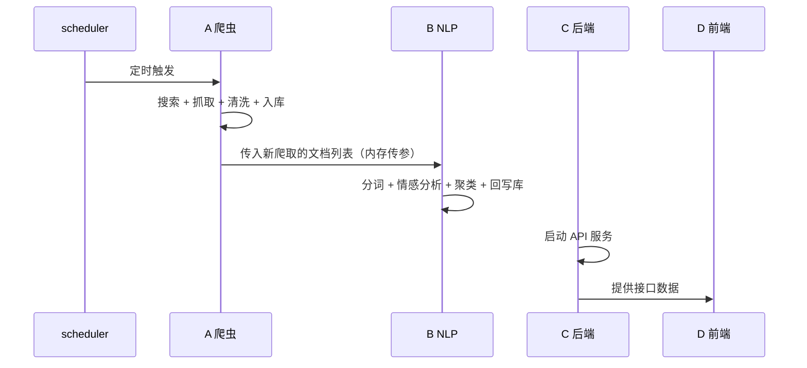

# 模块接口说明
以下A为爬虫，B为算法，C为后端，D为前端

## 模块作用

多平台新闻爬虫 + 数据清洗 + 定时调度。
产出结构化后的干净文本数据，写入 `raw_documents` 表供 B 模块使用。

## 当前已对接的平台

- 新浪新闻（JSON 搜索 API + newspaper3k 正文提取）

## 数据库表：raw_documents

| 字段 | 类型 | 说明 | 写入方 |
|------|------|------|--------|
| doc_id | VARCHAR(64) PK | UUID 主键 | A |
| source_platform | VARCHAR(20) | 来源平台（如'新浪新闻'） | A |
| source_url | VARCHAR(500) | 原文 URL（去重依据） | A |
| title | VARCHAR(500) | 文章标题 | A |
| content | TEXT | 清洗后的正文 | A |
| author | VARCHAR(100) | 作者/媒体来源 | A |
| publish_time | DATETIME | 发布时间 | A |
| crawl_time | DATETIME | 抓取时间 | A |
| content_hash | VARCHAR(64) | Simhash 值（近似去重用） | A |
| sentiment_label | VARCHAR(10) | 情感标签：正面/负面/中性 | B 回填 |
| sentiment_score | FLOAT | 情感置信度 | B 回填 |
| keywords | TEXT | 关键词列表（逗号分隔） | B 回填 |
| event_id | INT | 所属事件 ID（外键→events 表） | B/C 回填 |
| clean_status | VARCHAR(20) | 数据状态 | B/C 回填 |

### clean_status 的含义

作为每条数据的**处理进度标记**，方便运行时监控和排查问题：

| 状态 | 含义 |
|------|------|
| `raw` | A 刚写入，尚未经过 NLP 处理 |
| `enriched` | B 已完成情感/关键词/事件打标 |
| `dirty` | 数据异常，被流水线跳过 |

## 单程序流水线架构


```
scheduler 定时触发
  |
  +-- 1. A：爬虫 + 数据清洗 + 入库（clean_status = raw）
  |
  +-- 2. B：读取爬虫产出的数据 + NLP 分析 + 回写库
  |       （不需要轮询，调度器把数据直接传给 B）
  |
  +-- 3. C：启动 API 服务，供前端调用
         D：展示数据
```



## 调度器（scheduler.py）

按 `crawl_config.json` 配置定时触发整个流水线：

```python
# 合体后的调度流程示意
def scheduled_job():
    # 1. A 爬虫 + 写库
    new_docs = crawl_all_keywords()

    # 2. B NLP + 回写库（直接传参，不需查库）
    nlp.analyze_and_update(new_docs)

    # 3. C 的 API 始终可用
    # （API 服务在另一个线程中启动）
```


## 配置方式

### 数据库连接

数据库配置通过 `.env` 文件管理：

```bash
# 首次使用，复制模板并填入实际密码
cp .env.example .env
# 编辑 .env 文件，修改 DB_PASSWORD 等配置
```

`crawler_sina.py` 和 `scheduler.py` 在启动时自动加载 `.env` 中的配置。
## 启动方式

```bash
# 1. 首次使用
cp .env.example .env        # 创建配置文件
pip install -r requirements.txt  # 安装依赖

# 2. 测试爬虫（不写库）
python crawler_sina.py "关键词" --dry-run

# 3. 正式单次爬取
python crawler_sina.py "关键词"

# 4. 启动定时调度器
python scheduler.py
```

### 爬虫与调度参数

`crawl_config.json` 控制爬虫的搜索关键词和定时调度行为：

| 配置路径 | 说明 |
|----------|------|
| `crawler.keywords` | 搜索关键词列表 |
| `crawler.max_articles_per_keyword` | 每个关键词最多抓取条数 |
| `crawler.request_interval` | 请求间隔（秒） |
| `scheduler.interval_hours` | 定时调度间隔（小时） |
| `scheduler.run_at_start` | 启动时是否立即执行 |

## 对接说明

### B（NLP 算法组）

- 从 `raw_documents` 表读取 `content` 字段做 NLP 分析
- 将结果回填到 `sentiment_label`、`sentiment_score`、`keywords`、`event_id`

### C（后端接口组）

- 通过 `event_id` 外键将 `raw_documents` 关联到 `events` 表
- 密钥管理已通过 `.env` 解耦，后端可复用这套配置机制
 
### D（前端组）
 
- 查看 `raw_documents` 表的字段了解可展示的数据字段
- 查看调度器配置参数，便于在系统设置页面展示爬虫运行频率


